# BonaFide

[](https://anakin.io)
[](#anakin-usage)
[](core/scoring.ts)
[](https://nextjs.org)

**BonaFide checks an academic journal or conference invitation before you commit to it.** Paste the email.
It pulls out every claim the venue makes about itself, then checks each claim against an independent
source: Scopus, DOAJ, RDAP, Retraction Watch's hijacked-journal list, the venue's own site, and the named
speakers' university pages. A fixed rule engine turns the results into RED / AMBER / GREEN, and every row
links to its source. The agent then acts. **It emails the named keynote speakers to ask whether they
really agreed to appear, and when one replies, it wakes up, reads the reply and re-scores the case with
nobody watching.** It also drafts the decline or hold email to the sender.

> **Why this is different:** reading pages is common. This agent contacts a human witness and changes its
> verdict based on the answer. A keynote replying "I never agreed to this" turns the case RED on its own.
> Every guide to spotting predatory venues recommends this step, and in practice nobody does it.

| Live demo | Source |
|---|---|
| [bonafideagent-production.up.railway.app](https://bonafideagent-production.up.railway.app) | [github.com/sathvik9105/bonafide_agent](https://github.com/sathvik9105/bonafide_agent) |

---

## Contents

- [BonaFide](#bonafide)
  - [Contents](#contents)
  - [The problem](#the-problem)
  - [Architecture](#architecture)
  - [Anakin usage](#anakin-usage)
    - [Contribution to Anakin's catalog: a Wire Build](#contribution-to-anakins-catalog-a-wire-build)
  - [Why free sources come first](#why-free-sources-come-first)
  - [Engineering log](#engineering-log)
  - [Read, reason, act](#read-reason-act)
  - [Running locally](#running-locally)
  - [What I'd build next](#what-id-build-next)

---

## The problem

- **Scale.** Cabell's counts **over 15,500 active predatory journals** as of early 2026, most with
  professional-looking websites and convincing indexing statements.
- **Volume per victim.** One study tracked a junior researcher's inbox for six months after their first
  corresponding-author paper. It received **162 invitations**, and **only 11%** disclosed their publication fees.
- **The lookup tools have been bypassed.** "Is this journal in Scopus?" is a free, solved question, and
  attackers have moved past it. With **indexjacking**, they hijack a real journal's database entry by
  substituting a lookalike URL, so the Scopus lookup passes and the venue is still fake. **At least 67
  compromised journals** have been added to the Scopus list since 2013.
- **Conferences have almost no tooling.** Existing checkers are built around journals and ISSNs, and
  conference vetting is a manual checklist.
- **The decisive check is never automated.** That check is asking a named speaker whether they agreed to
  appear.

Getting it wrong costs a student the registration fee and the paper, which can't be published elsewhere
afterwards. The people most affected are final-year B.Tech/M.Tech students, PhD candidates and junior
faculty, heavily in India, where UGC-CARE and Scopus requirements create the incentive predators exploit.
The full product requirements are in [`docs/PRD.md`](docs/PRD.md).

---

## Architecture

```mermaid
flowchart LR
    IN["Invitation text"] --> EX["Claim extraction<br/><i>LLM, Zod-validated</i>"]
    EX --> PLAN["Check planning<br/><code>appliesTo(claims)</code> per check"]

    PLAN --> S1
    subgraph S1["Stage 1: free sources, checks run in parallel"]
        direction TB
        A1["identity.url_match<br/>Retraction Watch via Wire → DOAJ → Scopus"]
        A2["indexing.scopus · indexing.doaj"]
        A3["domain.age (RDAP)"]
        A4["contact.domain · timeline.plausibility"]
    end

    S1 --> S2
    subgraph S2["Stage 2: Anakin, checks run in parallel"]
        direction TB
        B1["people.reality<br/>Search + Scrape"]
        B2["proceedings.exist<br/>Search + Scrape → Crossref"]
        B3["venue.structure<br/>Map"]
        B4["reports.prior<br/>Search"]
    end

    S2 --> SCORE["Scoring<br/><b>deterministic rule, no LLM</b>"]
    SCORE --> DISP["Disposition email<br/><i>LLM drafts the prose</i>"]
    SCORE --> OUT["Speaker outreach<br/><i>fixed template</i>"]
    OUT -. "reply, minutes or hours later" .-> POLL["IMAP poller (30s)<br/>LLM classifies:<br/>CONFIRMS / DENIES / UNAWARE / UNCLEAR"]
    POLL -. "appends people.callback" .-> SCORE
```



*The LLM does four jobs: it extracts claims, judges whether a scraped page mentions the venue, classifies a
speaker's reply into one of four labels, and writes prose. **It never decides the verdict.** The verdict
comes from [`core/scoring.ts`](core/scoring.ts), which is ten lines with no model call. The same findings
always produce the same verdict. The dotted path runs later: a speaker reply appends a finding and the case
is scored again, with no user present.*

The whole rule:

```ts
if (findings.some(f => f.id === 'people.callback' && (f.excerpt === 'DENIES' || f.excerpt === 'UNAWARE'))) return 'RED';
if (fatal.length >= 1) return 'RED';
if (major.length >= 2) return 'RED';
if (major.length === 1) return 'AMBER';
if (contradicted.length === 0 && verified.length >= 4) return 'GREEN';
return 'AMBER';                                  // insufficient evidence
```

Three design rules sit around it:

- **AMBER means "not enough evidence", not "a bit suspicious".** This is the honest result for an obscure
  but real regional workshop, and it's what keeps the product from making false accusations.
- **One major per check.** Extra major contradictions from the same check are downgraded to minor, so no
  single check can reach RED alone.
- **Every check can fail on its own.** A check that can't reach its source returns `unverifiable` and never
  stops the run.

Every check's contract (what it applies to, each outcome, severities) is in [`docs/SPEC.md`](docs/SPEC.md).
The spec is changed first, then the code.

---

## Anakin usage

All Anakin calls go through [`providers/anakin.ts`](providers/anakin.ts) using plain `fetch`, with a disk
cache (`cache/<sha256>.json`) and a per-run credit ledger that refuses any call that would exceed
`MAX_CREDITS_PER_RUN`. The API doesn't report per-call usage for scrape, search or map, so those figures come
from Anakin's published prices. The Wire action's response includes `credits_used`, and the ledger records that.

| Anakin product | Used by | What it does there | Credits |
|---|---|---|---|
| **URL Scraper** (`/v1/url-scraper/scrape`) | `people.reality`, `proceedings.exist` | Reads the venue's speaker/committee page, the speaker's own university page, and last year's proceedings page (for DOIs) | 1 per scrape; free on an Anakin cache hit or a failure |
| **Search** (`/v1/search`) | `people.reality`, `proceedings.exist`, `reports.prior` | Finds each speaker at their stated affiliation, finds the prior edition, and looks for credible warnings about the venue | 3 per search |
| **Map** (`/v1/map`) | `venue.structure` | Lists the conference site's pages and sorts them into committee, CFP, dates, proceedings and contact. A near-empty site is a weak signal, capped at major | 1 per map |
| **Wire action** (`/v1/wire/task`) | `identity.url_match` | Looks up the ISSN or journal title on Retraction Watch's Hijacked Journal Checker **before** comparing DOAJ and Scopus. A match is a fatal contradiction linked to Retraction Watch's list | 1 per lookup |
| **Wire Build** (`/v1/wire/build-request`) | One-off, [`scripts/file-wire-build.ts`](scripts/file-wire-build.ts) | Created the Wire action above (see below) | 200, once |

**Measured costs** (from [`docs/ENGINEERING_LOG.md`](docs/ENGINEERING_LOG.md), uncached):

| Run | Credits | Breakdown |
|---|---|---|
| `predatory-1`, Stage 2 | **12** | people.reality 6 (2 searches; the venue scrape failed, free) · proceedings.exist 3 · reports.prior 3 |
| `flip-1`, full `?fresh=1` run | **11** | people.reality 8 (2 searches, 2 page scrapes) · reports.prior 3 |
| `legit-1` (PLOS ONE) | **3** | only reports.prior applies. The Wire pre-check, added afterwards, adds 1 |
| Any of the above, run again | **0** | served from the disk cache |

Measured latency: an inline scrape of neurips.cc took **3.5 s** round trip, and a search took **0.76 s**.

### Contribution to Anakin's catalog: a Wire Build

Anakin's catalog had nothing for research integrity, so I built the missing piece.

- **Filed:** `POST /v1/wire/build-request` for
  `retractionwatch.com/the-retraction-watch-hijacked-journal-checker/`, `visibility: public`. Goal: *given a
  journal title or ISSN, return whether it is on the Hijacked Journal Checker list, and if so the legitimate
  journal's title, ISSN and homepage alongside the clone's URL.*
- **Build ID:** `988aaebe-8811-4882-986f-3715c2fcf80a`. Filed 10:22 UTC, status `success` at 10:27 UTC on
  14 Sep 2026, 200 credits.
- **Published action:** `act_retractionwatch_com_hijacked_journal_check` (catalog `retractionwatch-com`). It
  takes one `query` parameter, needs no auth and costs 1 credit.
- **The gap it fills:** the Wire catalog lists 964 sites, 71 of them in `research`. Those are publishers and
  scholarly indexes (Crossref, OpenAlex, PubMed, PLOS, arXiv, and so on). `retractionwatch-com` is the only
  entry that says whether a journal is *fraudulent*.
- **Verified live:** PLOS ONE (`1932-6203`) returns `on_list: false`. *Journal of Talent Development and
  Excellence* returns `on_list: true`, pointing to the clone at `iratde.com` and the real *Talent Development
  and Excellence* (ISSN `1869-0459`).

---

## Why free sources come first

Stage 1 uses free, authoritative sources on purpose: the Scopus source list (bundled in `data/`), the DOAJ
API, RDAP and Crossref. For the questions they answer, a registry record is **stronger evidence than a
scraped page**. "Scopus's own list has no such ISSN" is a statement a judge can check with one click. A web
page asserting the same thing is not. These sources also cost nothing and don't break when a site changes
its layout, so the core verdict works without spending a single Anakin credit. Anakin is used where no
registry can help: the venue's own site, a speaker's university page, a past proceedings page, and a
search for prior warnings. The retraction-list lookup is the one paid call in Stage 1, and it is there
because Retraction Watch's list is itself an authoritative record, just not one that had an API before
this build.

---

## Engineering log

These entries are here to show how carefully the evidence was tested, not as a changelog. In a product that
accuses a venue of fraud, most bugs mean *accusing someone falsely*. The full log is in
[`docs/ENGINEERING_LOG.md`](docs/ENGINEERING_LOG.md).

**1. A fuzzy title match nearly confirmed a fake journal.**
A character-bigram similarity threshold of 0.92 matched the invented *"International Journal of Advanced
**Computing** Research"* to the real, inactive *"…Advanced **Computer** Research"* at 0.931. Predatory titles
are deliberately one word off real ones. Matching is now on **whole words** (Jaccard ≥ 0.9, and this pair
scores 0.71). The matched or nearest title always appears in the excerpt, so a near-miss is visible
instead of silently wrong.

**2. The speaker check made a false statement about a real person.**
For an invented speaker at Tampere University, Anakin Search's only result with that surname was a *real*
academic with the same full name at a US university. The check accepted any `.edu` page as institutional,
scraped that person's page, and reported "no mention … on <name>'s page at Tampere University." Now a page
counts only if it is linked to the *stated* affiliation by its domain or its own title or snippet. Profile
sites like LinkedIn, ResearchGate and Scholar never count. The same work showed that **name collisions are
normal** in people search: any realistic invented name matches someone real. So a result at the right
university naming someone with a *nearly* identical surname now returns `unverifiable`, not a contradiction.
This is a deliberate, documented trade-off.

**3. A network error could permanently erase a speaker's answer.**
Only the first reply to each outreach email counts. When a transient `fetch failed` from Gemini hit during
reply classification, the handler recorded `UNCLEAR`, which meant the speaker's real `CONFIRMS` could never
be recorded afterwards. It surfaced while testing the demo scenario and would have broken the live
AMBER → GREEN flip. Now a failed classification records **nothing** and is retried on the next poll.

**4. Map API: the job ID has two different field names, and "done" isn't HTTP 200.**
`POST /v1/map` returns `{jobId}`, but `GET /v1/map/{id}` returns `{id}`. Reusing the scrape job's schema
dropped the ID entirely. Separately, the poll endpoint returns **HTTP 202 while `status: "processing"`**
and only 200 when the job completes. A loop that stopped on "not 200" returned after the first poll, so
every site that took longer than one poll (neurips.cc took three) was reported `unverifiable: map processing`
instead of mapped. Both issues were found by running the code against the live API. The fix waits for the
response body's own `status`.

**5. A domain that doesn't exist made Map report `INSUFFICIENT_CREDITS`.**
Mapping the demo fixture's fictional domain failed with a credits error every time, while the account had
322 credits and neurips.cc mapped fine seconds later. The error message does not describe the real problem.
The check already turns any Map failure into `unverifiable`, so no workaround was needed, but it's logged so
it isn't mistaken for a real balance problem during a demo.

Also in the log: a third-party snippet uses `POST /v1/scrape`, which returns 404, while the real route is
`/v1/url-scraper/scrape`. There is no balance or usage endpoint (`/v1/credits`, `/v1/usage` and `/v1/me` all
return 404). Scopus marks eLife as Inactive, and DOAJ's title search is fuzzy enough to return the wrong
journal first.

---

## Read, reason, act

**Read.** Every input is live. Stage 1 queries DOAJ, RDAP and Crossref, looks the venue up in the current
Scopus source list, and runs the Retraction Watch Wire action. Stage 2 uses Anakin to scrape the venue's
own site, map its pages, search for each named speaker at their stated university and scrape their page,
find last year's proceedings and resolve sample DOIs through Crossref, and search for credible warnings. The
agent picks which of these to run from what the invitation actually claims. No Scopus claim means no Scopus
check, and no named speakers means no speaker check. The plan is shown in the UI.

**Reason.** The verdict isn't written on any page the agent reads; it comes from the **disagreement between
sources**. Indexjacking is caught by comparing the homepage a registry lists for a journal with the domain
that actually sent the invitation. Neither source states the conclusion alone. A "15th Annual" conference on
a five-month-old domain contradicts itself. A 48-hour peer review promise contradicts what peer review is.
The LLM only answers narrow questions (*does this page mention this venue?*), and its answer must quote a
line that is literally on the page. A fixed rule combines the findings, capping any single check at one
major contradiction and treating missing evidence as AMBER, never RED.

**Act.** The agent sends email to people outside the system, which can't be undone. It writes to up to two
named speakers, skipping free-mail addresses and addresses on the organiser's own domain. The email is a
fixed three-sentence template written to read like the student sending it. A poller checks IMAP every 30
seconds and matches replies by a `[BF-xxxxxx]` token in the subject. It classifies each reply and scores the
case again: `DENIES` or `UNAWARE` forces RED, and `CONFIRMS` counts toward GREEN. When the run finishes, and
again whenever a reply moves the verdict to RED or AMBER, the agent drafts the disposition: a decline for
RED, a hold note for AMBER. The decline names what couldn't be verified, never accuses anyone of fraud, and
asks the sender to remove the address from their list. Nothing is sent unless the server runs with
`MAIL_MODE=live`. The default, `dry`, writes every email to the database. The API also requires a per-run
`sendMail: true`, and `MAIL_REDIRECT_TO` sends every live email to a test inbox instead.

---

## Running locally

Requires **Node 22** (TypeScript scripts run directly with no build step).

```bash
git clone https://github.com/sathvik9105/bonafide_agent.git
cd bonafide_agent
npm install
cp .env.example .env    # fill in the values below
npm run dev             # http://localhost:3000
```

`.env`:

| Variable | Purpose |
|---|---|
| `GEMINI_API_KEY`, `GEMINI_MODEL_EXTRACT`, `GEMINI_MODEL_FAST` | Google AI Studio key and model names. Models are never hardcoded (`gemini-3.6-flash` works on a new key; `gemini-2.5-flash` returns 404) |
| `ANAKIN_API_KEY`, `ANAKIN_BASE_URL` | `https://api.anakin.io` |
| `GMAIL_USER`, `GMAIL_APP_PASSWORD`, `SMTP_HOST`, `IMAP_HOST` | Mailbox for sending outreach and polling replies (Gmail by default) |
| `MAIL_MODE` | `dry` (default): emails are written to the database and logged, never sent. `live`: actually sent |
| `MAIL_FROM_NAME`, `BONAFIDE_USER_NAME` | Emails are signed with `BONAFIDE_USER_NAME`. **Set it before any live run**, or they are signed with the "BonaFide Verification" branding, which gets binned |
| `MAIL_REDIRECT_TO` | Safety net: every live email goes here instead of the real recipient |
| `USE_CACHE` | `1` in development. Set `0` for a demo where the network calls should be real |
| `MAX_CREDITS_PER_RUN` | Hard stop per run (default `20`) |
| `DB_PATH`, `CROSSREF_MAILTO` | Optional: SQLite path (default `./bonafide.db`), and a contact address for Crossref's polite pool |

Run the checks against a fixture without the UI (a fixed `--now` makes the date checks reproducible):

```bash
node --no-warnings --env-file=.env scripts/run-check.ts fixtures/hijacked-1.txt --now 2026-09-13
node --no-warnings --env-file=.env scripts/run-check.ts fixtures/flip-1.txt venue.structure --no-cache
```

[`fixtures/`](fixtures/README.md) covers each scenario: a real journal on a lookalike domain
(`hijacked-1`), a real Scopus journal with an invented publisher (`hijacked-2`), a mass-mailed fake
conference (`predatory-1`), a polished fake with nothing to contradict (`predatory-3-polished`), the
AMBER workshop a speaker reply resolves (`flip-1`), and PLOS ONE (`legit-1`).

**Repository layout**

```
app/        Next.js UI and API routes (verify, case, simulate-reply, poll-replies)
core/       orchestrator, claim-driven check plan, checks/, scoring rule, speaker callback
providers/  all external I/O: Anakin, registries (DOAJ, Crossref, RDAP, Scopus), Gemini, mail, cache
store/      SQLite schema and queries
data/       Scopus source list (CSV), rebuilt with scripts/build-scopus-csv.ts
fixtures/   invitation scenarios used for testing
scripts/    run-check, Scopus CSV build, Wire Build request and poll
docs/       SPEC (per-check contracts), PRD, ENGINEERING_LOG
```

Stack: Next.js 16 (App Router) + TypeScript, Tailwind, SQLite via `better-sqlite3`, Gemini via
`@google/genai`, `nodemailer` + `imapflow`, Zod. There is no queue, ORM or auth.

---

## What I'd build next

- **Sending as the user, through OAuth.** Outreach currently goes out from one developer-configured Gmail
  account using an app password. For real users, the speaker email must come *from the student*. That's
  what makes a professor answer, and replies should reach the student's own inbox. The plan is Gmail and
  Microsoft OAuth with send and read scopes per user, a per-user token store, and the reply poller watching
  each connected mailbox for its own `[BF-…]` tokens instead of one shared inbox. That also means adding the
  accounts this build deliberately left out.
- **Closing the Stage 1 blind spot.** `fixtures/predatory-3-polished.txt` is a fake conference with no ISSN,
  its own-domain email, a six-week review and no pressure language. Stage 1 has nothing to contradict, so it
  relies on the speaker callback. Better conference-side sources are the biggest remaining gap.
- **Using more of the Retraction Watch data.** The Wire action returns the legitimate journal's homepage
  field, but it came back empty in the matches tested. Where it is filled, it could feed straight into the
  URL comparison.
- **Streaming and permalinks.** Server-sent events so findings appear as they finish, and a `/case/[id]`
  page. Both were planned and cut to protect the core loop. The API route for `/case/[id]` already exists.
- **A real, redacted predatory invitation** to replace the synthetic `predatory-1` fixture.
